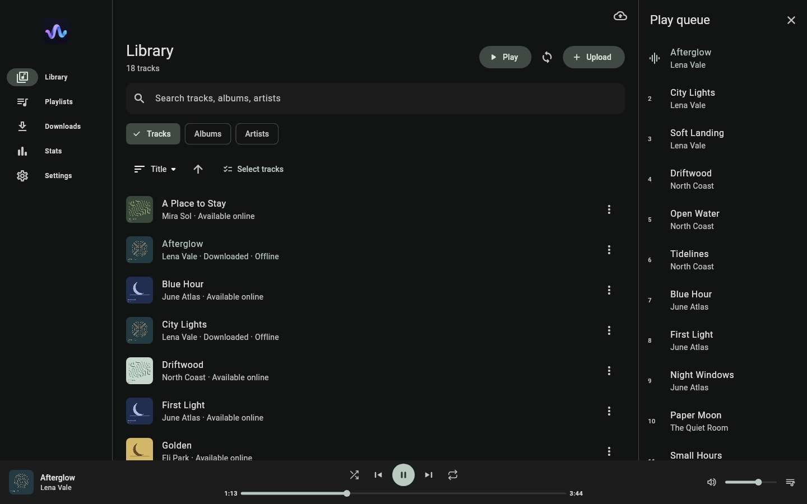
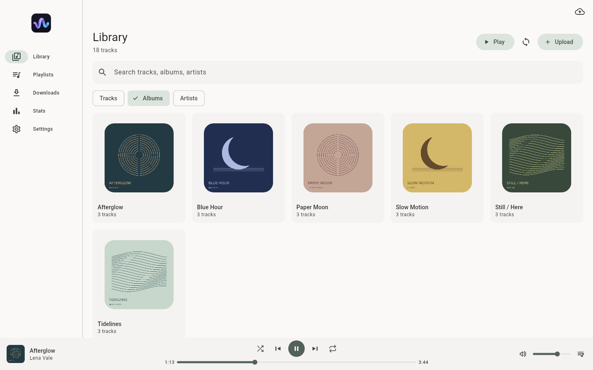
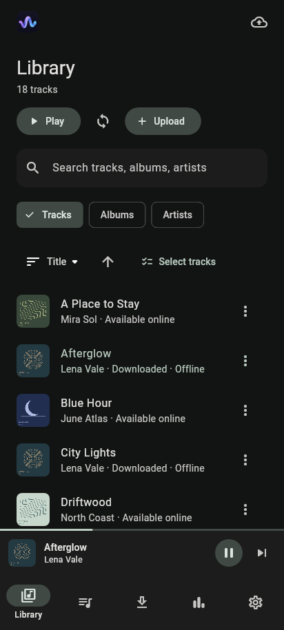
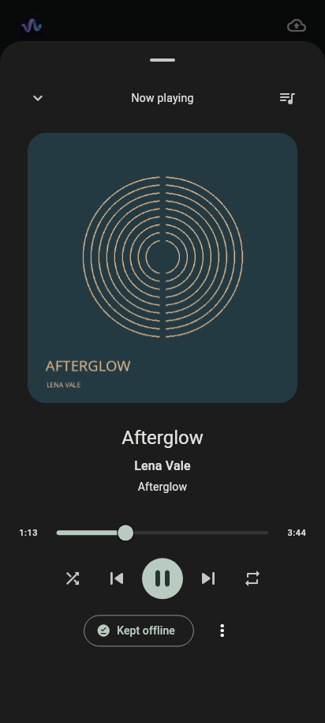

# 韵 · Yun

A Material 3 music player for a private, self-hosted library. One Flutter client targets **Linux x64, macOS ARM64, Android ARM64, and Windows x64**. It is backed by an account-isolated Rust server. Flutter is pinned with FVM.

## Screenshots

Rendered from the Flutter UI using a demo library and original sample artwork.

| Desktop · Library & queue (dark) | Desktop · Albums (light) |
| --- | --- |
|  |  |

| Mobile · Library | Mobile · Now playing |
| --- | --- |
|  |  |

## Features

- Adaptive mobile and desktop library, albums/artists/search, queue, shuffle/repeat, keyboard shortcuts, light/dark/system appearance, and metadata and artwork editing.
- Desktop app-volume slider and mute, including compact windows and now playing. On desktop, volume, mute, shuffle, and repeat survive app restarts. Android uses system volume and remembers shuffle and repeat.
- Desktop tray: left-click restores Yun, right-click opens Show/Quit. **Settings → Window behavior** chooses whether closing the window quits (default) or minimizes to the tray without stopping music. Android and iOS are unchanged. If the tray is unavailable, the window is never hidden.
- Admin-created accounts, Argon2id passwords, rotating and revocable sessions, and authenticated original-file streaming with byte-range seeking.
- File selection in the app and drag-and-drop on desktop, durable resumable uploads, embedded tags and artwork, per-account deduplication, quotas, and validation.
- Versioned playlists with conflict detection and incremental library sync.
- Explicit offline selections for tracks, albums, and playlists. Downloads are resumable and checksum-verified. Artwork is cached per account, with byte progress and storage management.
- Monotonic listening-time segments, a durable offline outbox, idempotent server ingestion, listening history, and personal track, artist, and album rankings.
- Android foreground audio, macOS media controls, Linux MPRIS and Windows SMTC adapters, platform configurations, and native artifact workflows.
- Container and HTTPS deployment, stopped-server backup and restore, unit and widget tests, real Rust↔Dart TCP integration tests, CI, and evaluation packaging.

**This is an evaluation candidate, not a certified four-platform release.**
[Hosted CI](https://github.com/BIGGASSS/Yun/actions/workflows/ci.yml) builds all four native packages and runs Flutter and Rust tests, TCP integration tests, null-output libmpv playback, container backup and restore, and isolated keyring tests. Choose a successful run for the version you want; its public evaluation artifacts are kept for 14 days. See [validation evidence](docs/VALIDATION.md) for the tested scope and version-specific results.

These still need the gates in [docs/VALIDATION.md](docs/VALIDATION.md): hardware playback, Android/macOS/Windows runtime behavior, production signing, public TLS deployment, and redistribution-license review. Not included: transcoding, public signup, social features, DRM, or stats.fm service integration.

## Develop

Install [FVM](https://fvm.app/), Rust (see `rust-toolchain.toml`), and the native Flutter toolchain for your host. For release builds, don't replace the exact `.fvmrc` version with a floating channel.

```sh
fvm install --skip-pub-get
fvm flutter pub get
cargo build --locked --manifest-path server/Cargo.toml

# Create an account; password is prompted privately (minimum 12 bytes).
# Stop the server before running administrative commands.
server/target/debug/yun-server --data-dir ./yun-data create-user alice
server/target/debug/yun-server --data-dir ./yun-data serve --insecure-loopback

# In a second terminal:
fvm flutter run -d linux
```

In **Settings**, connect to `http://127.0.0.1:8080` and sign in. HTTP is allowed only on loopback; remote clients need an HTTPS server URL. For local development, an attached Android device can use `adb reverse tcp:8080 tcp:8080`. Don't enable global cleartext or bypass certificate validation.

Dart fetches remote audio with certificate verification and streams it to the decoder through a private loopback relay, so account tokens never reach the native decoder. Audio redirects are rejected; use the final server URL. See [playback TLS](docs/PLAYBACK_TLS.md).

Native prerequisites and caveats: [Linux](linux/README.md), [Android](android/README.md), [macOS](macos/README.md), [Windows](windows/README.md). On Linux, you need libmpv at runtime and an unlocked Secret Service keyring for credentials. KWallet is supported through its `org.kde.secretservicecompat` endpoint when the standard `org.freedesktop.secrets` name is absent. No separate GNOME Keyring installation is needed. See [Linux setup](linux/README.md). The Windows SMTC bridge requires Rust. Its Dart bridge version is pinned to match the native generator.

## Verify

```sh
cargo fmt --manifest-path server/Cargo.toml --check
cargo test --manifest-path server/Cargo.toml --locked
cargo clippy --manifest-path server/Cargo.toml --locked --all-targets --all-features -- -D warnings
# Real-client integration tests use server/target/debug/yun-server by default.
fvm dart format --output=none --set-exit-if-changed lib test
fvm flutter analyze
fvm flutter test
# Android-free registration/cancellation contracts (JDK 17+):
bash android/test-audio-focus.sh
bash packages/audio_service/android/test-connection.sh
python3 scripts/api_smoke.py
python3 scripts/test-release-tooling.py
# Requires libmpv; real decoding/transport with null audio, not hardware proof:
RUN_NATIVE_PLAYBACK=1 fvm flutter test test/services/native_playback_test.dart
```

Set `YUN_SERVER_BINARY` to test a different prebuilt server. CI passes the built server artifact to the Flutter tests, so integration tests can't be skipped silently. The native smoke test is opt-in locally and runs in Linux CI.

## Offline and privacy

- Downloads are explicit: pick tracks, albums, or playlists. Originals are never evicted silently.
- Completed downloads always play from the device. A missing, unreadable, or undecodable local copy shows a playback error instead of streaming.
- Signing out keeps downloaded files and pending history. This is app-level isolation, not encryption or DRM against the device owner.
- One play counts per session after `min(30 seconds, half the track duration)` of active listening.
- In **Downloads**, **Verify downloads** checks cached audio against its SHA-256 checksum.

Full rules, including caching, staging, redownload, sign-out, and listening history: [docs/OFFLINE.md](docs/OFFLINE.md).

## Structure

```text
lib/ui/          Adaptive Material 3 screens and player
lib/core/        Account lifecycle, sync coordination, playback, listening tracker
lib/services/    HTTP/auth, Drift cache, transfers, artwork, native adapters
lib/models/      Shared typed client models
server/          Rust service, migrations, CLI and integration tests
android/ linux/ macos/ windows/   Native runners
test/            Client unit/widget and real-server integration tests
deploy/          Non-root server container, Caddy and Compose
scripts/         Smoke tests, backup/restore and packaging
docs/            API contract, operations, release and validation records
```

The client uses an injectable `ChangeNotifier` façade and Flutter's built-in navigation. Riverpod and go_router are deferred until a routing requirement exists. Drift uses explicit transactional SQL, with no code generation. Server statistics are computed directly from immutable events, with no aggregate tables.

## Deploy and distribute

See [OPERATIONS.md](docs/OPERATIONS.md) for Caddy and Compose setup, account management, monitoring, and verified backup and restore. **Do not publish the HTTP origin port.** The server is for authenticated personal uploads, not hostile public hosting. Its bounded metadata parser is not an OS sandbox.

[RELEASE.md](docs/RELEASE.md) covers releases, evaluation artifacts, and installation. Push a `v*` tag (for example `v1.0.0`) to validate the release, build all clients and the Linux server, and publish a GitHub Release with checksums.

Tag releases use the configured Android release signing. macOS and Windows artifacts are unsigned. CI and the separate **Release candidates** workflow keep only publicly accessible workflow artifacts. Release candidates default to debug-signed Android APKs. Opt-in release signing fails closed. Production signing and notarization, and dependency license and source obligations, remain release gates.

## License

Yun's first-party material is licensed under the [MIT License](LICENSE), copyright © 2026 BIGGASSS. Third-party components are not covered by this grant. They keep their own licenses and notices, including the vendored [Linux secure-storage plugin's BSD-3-Clause license](packages/flutter_secure_storage_linux/LICENSE), [nlohmann/json notices and licenses](packages/flutter_secure_storage_linux/linux/include/json.NOTICES.md), and [Flutter SDK action's MIT license](.github/actions/flutter-sdk/LICENSE) ([upstream provenance](.github/actions/flutter-sdk/UPSTREAM.md)).

The source license does not complete the binary redistribution review. Bundled dependencies (including mpv and FFmpeg), their notices, and any source obligations still need the [release license gates](docs/RELEASE.md#dependencylicense-redistribution-gate).
